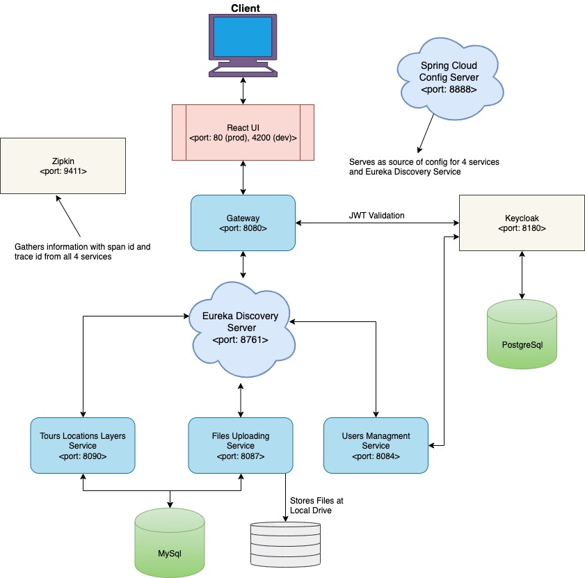
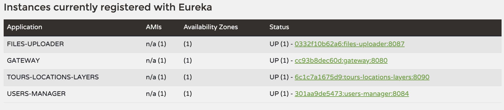
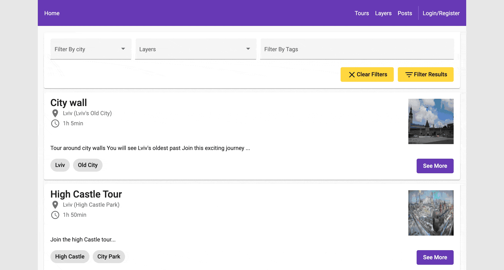

# Tours Application

This project is MVP for displaying map based information about specific areas user can choose (here it was called layers). This information is displayed as Post or Location grouped under Tour. Tour can have multiple Posts. Tours on its turn are grouped under Layers. Posts, Tours and Layers can be tagged and additional information can be attached, like duration, start, end periods. All of 3 entities can be filtered by this information.

## Microservices Architecture's Diagram

## Quick-start

### Just docker-compose

To build everything from scratch, just using docker-compose run following command from this project's root:
`docker-compose up -d`

Please, check that all of 4 services should be registered with eureka - [localhost:8761](https://localhost:8761), like so:

If some of 4 services hasn't been registered, restart container - `docker restart container_name`

And go to page [localhost](https://localhost:80) to see UI.

### docker-compose with some extra steps (for development)

Run `./mvnw install -DskipTests && mkdir -p target/dependency && (cd target/dependency; jar -xf ../*.jar)` command to build project and unpack jar (for quicker startup, instead of JarLauncher usage) for following projects:

1. gateway
2. tours-locations-layers
3. files-uploader
4. users-manager

For tours-ui - React project run `ng build`.

After all builds finished run from root `docker-compose -f docker-compose.dev.yml up`, see [localhost](https://localhost:80).

## City/Layer selection and correspondant Post/Tour/Layer viewing

## Layer/Tour/Post filtering

## User creation and Upgrading user's status to be able to create map items

## Layer creation process

## Tour and Post creation

## Todo:

Lot of bug fixes can be made and features implemented, like the following:

* More advanced idea of this application is with ability to enroll for a course
* To be able to pay for the course for enrollement
* To have a chat with tour owner for enrolled users
* For user who had tour to be able to review tour and guide

^^ for these features - calendar, paypal, chat, review and schedule services boilerplates are premade

* Also, token and refresh_token expire quickly, it would be a good idea to send signal request to refresh token each fixed interval while user is active and show popup - "Would you like to continue session", if user inactive with a countdown.
* Keykloak login page can be stylized better, like it described [here](https://www.baeldung.com/keycloak-custom-login-page)